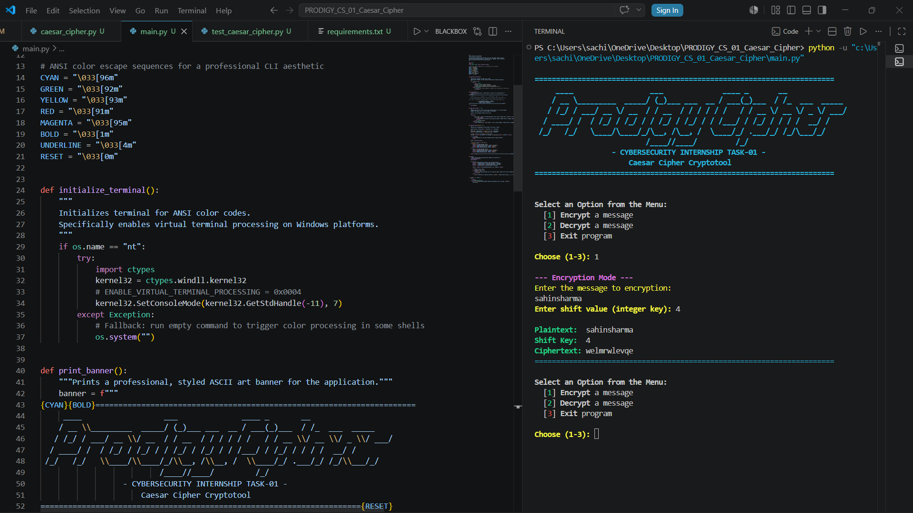
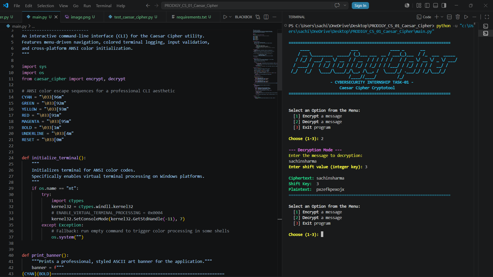

# 🛡️ Cybersecurity Internship Task-01: Caesar Cipher Encryption & Decryption Tool

---
[](https://www.python.org/)
[](LICENSE)
[](https://prodigyinfotech.dev/)
[](https://en.wikipedia.org/wiki/Cryptography)
[](test_caesar_cipher.py)
[](https://www.linkedin.com/in/sachin-sharma-b93345404)
[](https://github.com/sachin-120)
Welcome to the official repository for **Task-01** of my **Cybersecurity Internship at Prodigy InfoTech**. This project features a highly polished, production-ready implementation of the classic **Caesar Cipher** cryptographic algorithm. Engineered strictly in Python 3, it offers an interactive, ANSI-colored Command Line Interface (CLI) for secure, bidirectional text encryption and decryption, supported by a 100% compliant unit test suite.
---
## 📋 Table of Contents
1. [🎓 Internship Profile](#-internship-profile)
2. [🎯 Project Overview & Mission](#-project-overview--mission)
3. [🔐 Cryptographic Foundation & Theory](#-cryptographic-foundation--theory)
   - [Mathematical Definition](#mathematical-definition)
   - [Visual Cipher Mechanics](#visual-cipher-mechanics)
   - [Cryptanalysis & Vulnerabilities](#cryptanalysis--vulnerabilities)
4. [🛠️ Technical Architecture & Module Design](#%EF%B8%8F-technical-architecture--module-design)
   - [Directory Layout](#directory-layout)
   - [Module Interactions](#module-interactions)
5. [✨ Production Features in Detail](#-production-features-in-detail)
6. [🖥️ Interactive Command Line Interface (CLI) Walkthrough](#%EF%B8%8F-interactive-command-line-interface-cli-walkthrough)
7. [📸 Interface Screenshots & Operational Walkthrough](#-interface-screenshots--operational-walkthrough)
8. [📥 Production Installation & Setup](#-production-installation--setup)
9. [🧪 Robust Test Harness & Verification](#-robust-test-harness--verification)
10. [📊 Performance & Complexity Analysis](#-performance--complexity-analysis)
11. [📝 Professional Git Version Control Workflow](#-professional-git-version-control-workflow)
12. [🔮 Security Engineering Roadmap](#-security-engineering-roadmap)
13. [📚 Academic References & Standards](#-academic-references--standards)
14. [👤 Professional Author Profile](#-professional-author-profile)
15. [📄 License](#-license)
---
## 🎓 Internship Profile
* **Company:** Prodigy InfoTech
* **Role:** Cybersecurity Intern
* **Specialization:** Applied Cryptography & Information Security
* **Task Identifier:** Task-01
* **Project Deliverable:** Secure Caesar Cipher Encryption & Decryption System
---
## 🎯 Project Overview & Mission
The primary goal of this project is to implement symmetric key cryptography principles using a command-line tool. While the Caesar Cipher is a historical algorithm, writing it to production standards involves addressing challenges common to modern security applications:
* **Zero Dependencies:** Minimizing the supply-chain attack vector by using only the Python standard library.
* **Input Validation & Sanitization:** Preventing buffer issues, parsing exceptions, and shell escape bugs.
* **Data Integrity:** Ensuring casing preservation and leaving non-alphabetic metadata (formatting, spacing, symbols) intact.
* **High Test Coverage:** Validating cryptographic boundaries (negative keys, overflow keys) via unit tests.
---
## 🔐 Cryptographic Foundation & Theory
### Mathematical Definition
The Caesar Cipher is a monoalphabetic substitution cipher where each character in a message is replaced by another character shifted a fixed number of positions down the alphabet. 
Let the English alphabet be mapped to integer values in the range $\mathbb{Z}_{26} = \{0, 1, 2, \dots, 25\}$, where $A \mapsto 0$, $B \mapsto 1$, $\dots$, $Z \mapsto 25$.
#### 1. Encryption Formula
For a plaintext character $p \in \mathbb{Z}_{26}$ and a shift key $k \in \mathbb{Z}$:
$$E_k(p) = (p + k) \pmod{26}$$
#### 2. Decryption Formula
For a ciphertext character $c \in \mathbb{Z}_{26}$ and a shift key $k \in \mathbb{Z}$:
$$D_k(c) = (c - k) \pmod{26}$$
In Python, the modulo operator (`%`) natively handles negative values according to modular arithmetic rules, meaning $D_k(c) = E_{-k}(c)$ holds true without requiring manual bounds-checking loops.
---
### Visual Cipher Mechanics
Below is a conceptual representation of how a single letter is shifted under a key of $k = 3$:
```text
Alphabet Ring:
  [A] ──► [B] ──► [C] ──► [D] ──► [E] ... ──► [Z]
   0       1       2       3       4           25
Shift Execution (Key = 3):
  Plaintext:  H  E  L  L  O
              │  │  │  │  │   (Convert to Z_26: H=7, E=4, L=11, L=11, O=14)
              ▼  ▼  ▼  ▼  ▼
  Formula:   (x + 3) mod 26
              │  │  │  │  │   (7+3=10, 4+3=7, 11+3=14, 11+3=14, 14+3=17)
              ▼  ▼  ▼  ▼  ▼
  Ciphertext: K  H  O  O  R   (Map back to Letters: K=10, H=7, O=14, O=14, R=17)
```
---
### Cryptanalysis & Vulnerabilities
In modern cybersecurity, the Caesar Cipher is considered insecure due to its small key space:
1. **Brute Force Attack:** Since there are only $25$ possible unique shift values (excluding $0$ and multiples of $26$), an attacker can easily decrypt a ciphertext by trying every possible key in a fraction of a second.
2. **Frequency Analysis:** In any language, certain letters appear more frequently than others (e.g., 'E', 'T', and 'A' in English). A shift cipher does not change the frequency distribution of letters, it only offsets it. An attacker can map the frequencies of the ciphertext letters to crack the key without trying all possibilities.
Therefore, this tool serves as an **educational showcase** of cryptographic principles, demonstrating how substitution works before studying more secure algorithms like the One-Time Pad (OTP) or the Advanced Encryption Standard (AES).
---
## 🛠️ Technical Architecture & Module Design
### Directory Layout
The project features a decoupled, clean code architecture:
```text
PRODIGY_CS_01/
├── assets/
│   ├── task_banner.png      # High-resolution documentation banner
│   ├── encryption.png       # Encryption Operation screenshot
│   └── decryption.png       # Decryption Operation screenshot
├── .gitignore              # Staging filter rules for Git
├── LICENSE                 # Legal licensing conditions (MIT)
├── caesar_cipher.py        # Core cryptographic operations
├── main.py                 # Interactive terminal runner and CLI console
├── requirements.txt        # Development dependencies (pytest)
└── test_caesar_cipher.py   # Regression and unit test suite
```
---
### Module Interactions
The flow of execution in this application is structured as follows:
```text
                      ┌───────────────┐
                      │    User CLI   │ (main.py)
                      └───────┬───────┘
                              │ 
                1. Inputs plain text & shift key
                              │
                              ▼
                      ┌───────────────┐
                      │ Cryptographic │ (caesar_cipher.py)
                      │    Engine     │ 
                      └───────┬───────┘
                              │
             2. Loops through characters:
                - Case preservation
                - Safe character bypassing
                - Modulo arithmetic mapping
                              │
                              ▼
                      ┌───────────────┐
                      │ Output Return │ (Returns transformed text to CLI)
                      └───────────────┘
```
---
## ✨ Production Features in Detail
* **Case-Preserving Transformation:** Distinct ASCII baselines are used for uppercase (`ord('A') = 65`) and lowercase (`ord('a') = 97`) characters during mathematical transformation.
* **Character Safety Bypass:** If a character is non-alphabetic (e.g., punctuation, numbers, spaces, emojis), the logic skips shifting and returns the character unmodified:
  ```python
  if not char.isalpha():
      return char
  ```
* **Infinite Wrap-Around:** Modulo-26 arithmetic ensures that shifts such as `-5`, `999`, or `0` are evaluated correctly without runtime index errors.
* **Cross-Platform ANSI Styling:** Native integration of ANSI color codes provides a clean user interface. On Windows systems, virtual terminal processing is initialized via Windows Kernel32 APIs:
  ```python
  import ctypes
  kernel32 = ctypes.windll.kernel32
  kernel32.SetConsoleMode(kernel32.GetStdHandle(-11), 7)
  ```
* **Robust Input Validation:** Standardizes error handling for invalid selections, non-integer keys, and empty strings.
---
## 🖥️ Interactive Command Line Interface (CLI) Walkthrough
Below is a detailed guide on how the menu operates under different scenarios:
### Launching the Application
Run the interface with:
```bash
python main.py
```
### Encryption Scenario
The CLI displays an ASCII art banner, asks for an option, validates user input, prompts for the message, and requests a shift key.
```ansi
======================================================================
     ____                  ___              ____ _       __               
    / __ \_________  _____/ (_)___ ___  __ / ___(_)___  / /_  ___  _____  
   / /_/ / ___/ __ \/ __  / / __  / / / / / /   / / __ \/ __ \/ _ \/ ___/  
  / ____/ /  / /_/ / /_/ / / /_/ / /_/ / / /___/ / /_/ / / / /  __/ /      
 /_/   /_/   \____/\____/_/\__, /\__, /  \____/_/ .___/_/ /_/\___/_/       
                          /____//____/         /_/                         
                  - CYBERSECURITY INTERNSHIP TASK-01 -
                      Caesar Cipher Cryptotool
======================================================================
Select an Option from the Menu:
  [1] Encrypt a message
  [2] Decrypt a message
  [3] Exit program
Choose (1-3): 1
--- Encryption Mode ---
Enter the message to encrypt:
Hello, Prodigy InfoTech Interns! [2026]
Enter shift value (integer key): 7
Plaintext:  Hello, Prodigy InfoTech Interns! [2026]
Shift Key:  7
Ciphertext: Olssv, Wyvknnf PpmvAljo Pualyuz! [2026]
======================================================================
```
### Defensive Input Handling Scenario
If a user inputs letters instead of integers or enters an invalid menu option, the program catches the error and reprompts:
```ansi
Choose (1-3): 1
--- Encryption Mode ---
Enter the message to encrypt:
Secure System
Enter shift value (integer key): abc
[Error] 'abc' is not a valid integer. Please enter an integer key.
Enter shift value (integer key): 13
Plaintext:  Secure System
Shift Key:  13
Ciphertext: Fspher Fflgrz
======================================================================
```
---
## 📸 Interface Screenshots & Operational Walkthrough
Here is a visual breakdown of the application interfaces and operation modes. 
> [!NOTE]
> *Make sure to take screenshots of your running terminal window and place them inside the `assets/` directory with the filenames specified below.*
### 1. Encryption Operation

* **Description:** In encryption mode, the user inputs a plaintext string and a shift key. The program outputs the results in a formatted block showing the input text, key, and computed ciphertext with character safety and letter casing preserved.
### 2. Decryption Operation

* **Description:** Decryption performs the reverse mathematical shift of the key. The console returns the plaintext output by calculating the negative shift parameter.
---
## 📥 Production Installation & Setup
### Prerequisites
* **Python Engine:** Python 3.6 or higher must be installed on your operating system.
* Check your current version:
  ```bash
  python --version
  ```
### Step-by-Step Installation
1. **Clone the Repository:**
   ```bash
   git clone https://github.com/sachin-120/PRODIGY_CS_01_Caesar_Cipher.git
   cd PRODIGY_CS_01_Caesar_Cipher
   ```
2. **Initialize isolated Virtual Environment:**
   * **On Windows:**
     ```bash
     python -m venv venv
     venv\Scripts\activate
     ```
   * **On macOS/Linux:**
     ```bash
     python3 -m venv venv
     source venv/bin/activate
     ```
3. **Install Development Package Dependencies:**
   While the core runtime uses only standard libraries, testing relies on `pytest`:
   ```bash
   pip install -r requirements.txt
   ```
---
## 🧪 Robust Test Harness & Verification
The suite contains tests to ensure mathematical correctness and prevent regressions.
### Covered Test Cases
* `test_basic_encryption`: Validates positive shifts on simple strings.
* `test_basic_decryption`: Validates negative shifts on simple strings.
* `test_case_preservation`: Confirms that casing remains intact.
* `test_non_alphabetic_characters`: Ensures numbers, spaces, and punctuation are skipped.
* `test_large_shift_values`: Validates shift values greater than 26 wrap around correctly (e.g., key `100` translates to a modulo shift of `22`).
* `test_negative_shift_values`: Confirms mathematical backward shifting (e.g., shift `-29` translates to a modulo shift of `-3`).
* `test_zero_shift`: Ensures key `0` yields the original message.
### Run Tests Natively
Execute the Python test runner:
```bash
python -m unittest test_caesar_cipher.py
```
### Run Tests via PyTest
Execute tests with standard formatting:
```bash
pytest -v test_caesar_cipher.py
```
---
## 📊 Performance & Complexity Analysis
### Complexity Matrix
|
 Operation 
|
 Time Complexity 
|
 Space Complexity 
|
 Auxiliary Space 
|
|
:---
|
:---
|
:---
|
:---
|
|
**
Character Shifting
**
|
 $\mathcal{O}(1)$ 
|
 $\mathcal{O}(1)$ 
|
 $\mathcal{O}(1)$ 
|
|
**
Message Encryption
**
|
 $\mathcal{O}(n)$ 
|
 $\mathcal{O}(n)$ 
|
 $\mathcal{O}(1)$ 
|
|
**
Message Decryption
**
|
 $\mathcal{O}(n)$ 
|
 $\mathcal{O}(n)$ 
|
 $\mathcal{O}(1)$ 
|
### Mathematical Rationale
1. **Time Complexity:** For a message of length $n$, the algorithm iterates through each character exactly once. The operations inside the loop (condition checks, ASCII conversion, addition, modulo, and casting) are $\mathcal{O}(1)$ constant time operations. Thus, overall time complexity is linear: $\mathcal{O}(n)$.
2. **Space Complexity:** The output string is built dynamically using Python's generator expressions and the `''.join()` method. This allocates memory linear to the input size $n$. Auxiliary storage for index manipulation uses a constant space of $\mathcal{O}(1)$.
---
## 📝 Professional Git Version Control Workflow
To present this project professionally on GitHub, follow standard development workflows and commit message conventions.
### Conventional Commit Standard
This repository uses the [Conventional Commits](https://www.conventionalcommits.org/) format to structure its commit history:
* `feat: ...` for new functional features (e.g., CLI setup).
* `fix: ...` for bug fixes.
* `docs: ...` for documentation modifications (e.g., README updates).
* `test: ...` for adding or modifying unit tests.
* `refactor: ...` for code changes that neither fix a bug nor add a feature.
### Step-by-Step GitHub Deployment
If you are staging and pushing this code from your local machine, use the commands below:
```bash
# Initialize git repository
git init
# Add all files to the staging index
git add .
# Commit with a message
git commit -m "feat: implement Caesar Cipher cryptotool with ANSI CLI and unit tests"
# Rename local default branch to main
git branch -M main
# Add remote remote repository pointing to GitHub
git remote add origin https://github.com/sachin-120/PRODIGY_CS_01_Caesar_Cipher.git
# Push changes securely to the main branch
git push -u origin main
```
---
## 🔮 Security Engineering Roadmap
Future enhancements plan to build upon this repository:
1. **Vigenère & Vigenère Autokey Cipher support:** Upgrade to polyalphabetic ciphers to resist basic frequency analysis.
2. **Brute Force Decryption Module:** Integrate a feature to automatically crack ciphertexts by brute-forcing all 25 shift possibilities and ranking them using dictionary checks.
3. **Statistical Frequency Cryptanalysis:** Integrate automated cryptanalysis that calculates the Chi-Squared ($\chi^2$) statistic of letter distributions to decrypt Caesar-shifted text without a key.
4. **Interactive GUI:** Build a Tkinter-based or web-based Streamlit application.
---
## 📚 Academic References & Standards
* **RFC 2828:** Internet Security Glossary - [Information Systems Security Cryptography Standards](https://datatracker.ietf.org/doc/html/rfc2828)
* **Symmetric Encryption History:** [Substitution Ciphers and Caesar Cipher Foundations (Stanford)](https://crypto.stanford.edu/)
* **PEP 8:** Style Guide for Python Code - [Python Standards](https://peps.python.org/pep-0008/)
---
## 👤 Professional Author Profile
* **Developer:** Sachin
* **Internship Role:** Cybersecurity Intern (Prodigy InfoTech)
* **GitHub Profile:** [@sachin-120](https://github.com/sachin-120)
* **LinkedIn Profile:** [Sachin on LinkedIn](https://www.linkedin.com/in/sachin-sharma-b93345404)
* **Project Repository:** [PRODIGY_CS_01_Caesar_Cipher](https://github.com/sachin-120/PRODIGY_CS_01_Caesar_Cipher)
---
## 📄 License
This project is licensed under the MIT License - see the [LICENSE](LICENSE) file for details.
